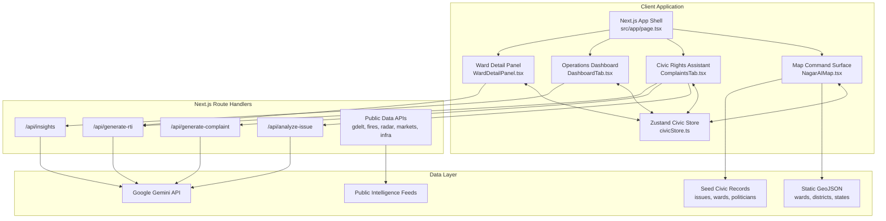
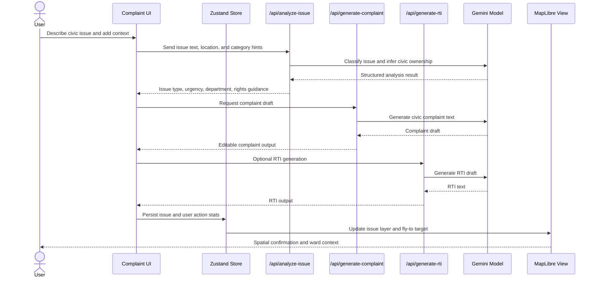
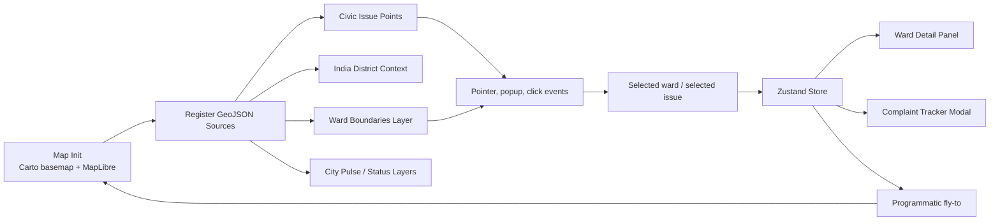
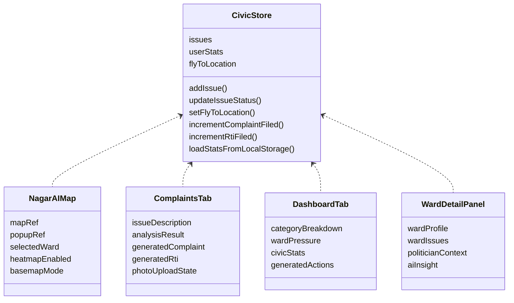
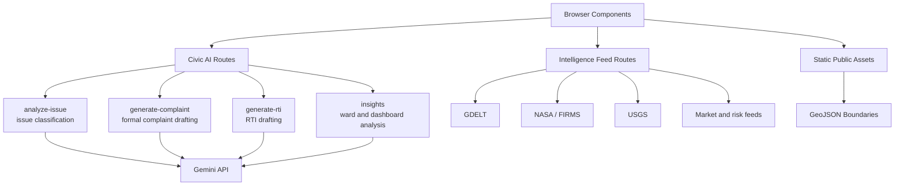
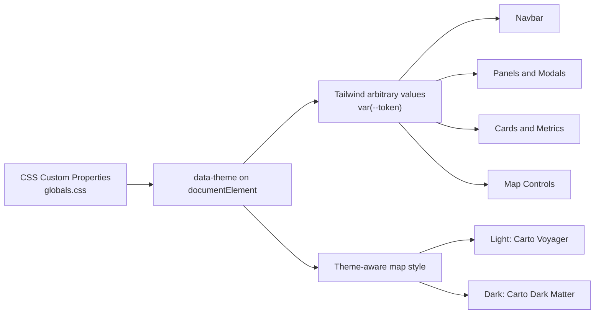

# NagarAI

India's civic accountability engine for mapping local issues, analyzing citizen complaints, and turning civic friction into structured action.

NagarAI combines an interactive ward-level map, complaint intelligence workflows, public civic datasets, and AI-assisted drafting tools into a command-center interface for urban governance, citizen reporting, and civic operations.

## Overview

NagarAI is a Next.js application built for civic-tech workflows in India. It helps users explore local ward conditions, track civic complaints, identify department ownership, generate complaint or RTI drafts, and view issue density across map and dashboard views.

The interface is designed as a high-end civic control terminal: fast to scan, map-first, data-dense, and optimized for repeated operational use.

## Key Features

- Interactive civic map with Indian state, district, and Bangalore ward datasets
- Ward detail panels with local metrics, political context, and issue summaries
- Complaint capture flow with AI analysis and structured issue classification
- AI-generated complaint drafts and RTI drafts
- Dashboard view for civic categories, SLA pressure, and operational signals
- Complaint tracker modal for reviewing and inspecting issue records
- Light and dark theme support through CSS custom properties
- MapLibre-powered mapping with custom overlays and civic data layers
- Zustand-based client state for responsive map and complaint interactions

## Tech Stack

- Next.js 16
- React 19
- TypeScript
- Tailwind CSS 4
- MapLibre GL
- Zustand
- Framer Motion
- Google Gemini API
- Recharts
- Lucide React

## Project Structure

```text
src/
  app/
    api/                 API routes for AI analysis, civic insights, RTI generation, and data feeds
    complaints/          Complaints page route
    dashboard/           Dashboard page route
    page.tsx             Main app shell
  components/            Map, dashboard, complaint, navbar, theme, and panel components
  data/                  Seed civic data and department metadata
  lib/                   Gemini client and supporting utilities
  store/                 Zustand civic state
public/
  data/                  GeoJSON and static map datasets
```

## Technical Architecture

NagarAI is organized as a client-heavy geospatial intelligence interface backed by focused Next.js API routes. The browser owns the live interaction loop: map state, selected ward state, issue overlays, modal state, and complaint workflow state. Server routes are used where secrets, model calls, data normalization, or third-party feed aggregation belong.



### Execution Model

The application separates fast UI state from slower intelligence workflows:

- Map rendering, selected ward context, user statistics, fly-to actions, and local complaint records are managed in the client store.
- AI calls are isolated behind server routes so the Gemini key never needs to be exposed to the browser.
- Static geospatial files are served from `public/data`, allowing MapLibre to draw civic boundaries without requiring a database for the current build.
- Dashboard and modal views derive their operational summaries from the same issue records used by the map, keeping the interface consistent across views.



### Map Rendering Pipeline

The map is not a passive background. It is the primary interaction surface and acts as the shared spatial index for wards, issues, overlays, and civic drill-downs.



### State Ownership

NagarAI keeps state intentionally small and operational. The store coordinates shared civic state while leaving component-specific UI concerns local to the component.



### API Boundary

The API layer is intentionally thin. Each route does one job: receive structured UI input, call a model or public data source when needed, normalize the response, and return a client-ready payload.



### Design System Implementation

The visual system is implemented with theme-aware CSS custom properties and tactical UI primitives rather than one-off color usage. This allows the same components to operate across light and dark modes without duplicating component logic.



## Getting Started

### Prerequisites

- Node.js 20 or newer
- npm
- A Google Gemini API key for AI-assisted complaint, RTI, and insight generation

### Installation

```bash
npm install
```

### Environment Variables

Create a local environment file:

```bash
cp .env.example .env.local
```

For the current NagarAI AI flows, add:

```env
GEMINI_API_KEY=your_gemini_api_key_here
```

Some legacy and optional data-source variables are documented in `.env.example`. The app can still render its core interface without all optional integrations, but AI drafting and analysis require `GEMINI_API_KEY`.

### Run Locally

```bash
npm run dev
```

Open `http://localhost:3000`.

### Production Build

```bash
npm run build
npm run start
```

### Lint

```bash
npm run lint
```

## Core Workflows

### Map Intelligence

Use the map view to inspect civic conditions spatially. NagarAI overlays civic issues, ward boundaries, district context, and operational controls into a single map-first workspace.

### Civic Rights Assistant

The complaint flow helps users describe a problem in plain language, analyze the issue type, identify likely civic ownership, and move toward a complaint or RTI draft.

### Dashboard

The dashboard view provides a higher-level operational picture across categories, issue load, severity, and civic service pressure.

## Data

The project includes local static datasets for map rendering and civic exploration:

- Bangalore ward boundaries
- India state boundaries
- India district boundaries
- Seed civic issues
- Department contact metadata
- Politician and ward context data

These datasets live under `public/data` and `src/data`.

## Deployment

NagarAI is a standard Next.js application and can be deployed to Vercel or any Node-compatible hosting environment.

Recommended production steps:

1. Set `GEMINI_API_KEY` in the hosting provider's environment settings.
2. Run `npm run build`.
3. Serve with `npm run start` or the platform's Next.js adapter.

## Design Direction

NagarAI is intentionally designed away from generic dashboard defaults. Its interface uses a civic command-center language: precise typography, dense information hierarchy, glass-like tactical panels, sharp map controls, and theme-aware design tokens.

The goal is to feel like a serious public-interest intelligence suite, not a marketing landing page.

## Security Notes

- Do not commit `.env.local` or real API keys.
- Keep `GEMINI_API_KEY` server-side only.
- Review any public data-source integrations before exposing new API routes.

## License

This repository is currently private. Add a license before distributing, reusing, or open-sourcing the project.
